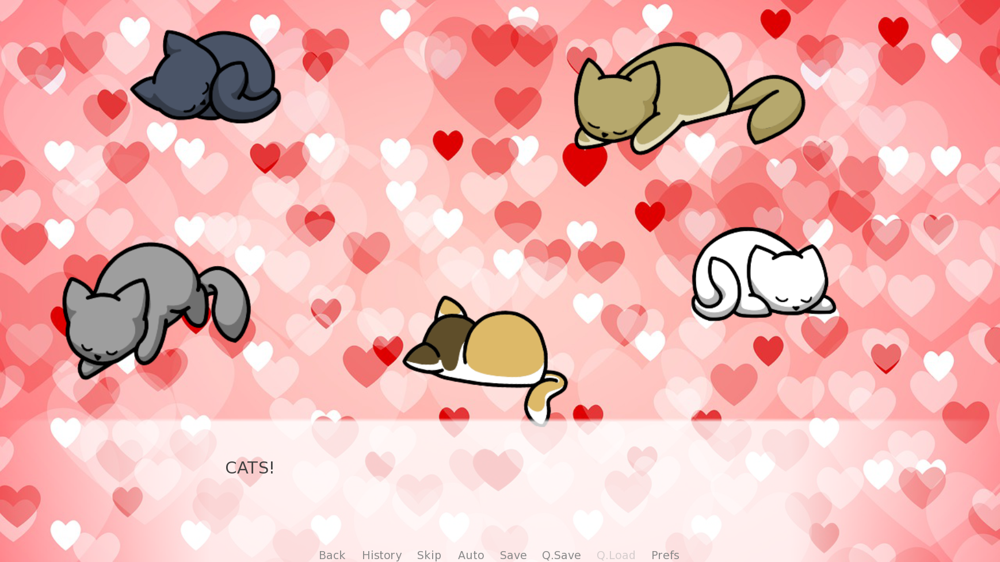

# **Mira**
## **Description**
A visual novel made in a few days so I could practice Ren'Py. It focuses on the main character's relationship with their friend, Mira. It's made with open-source assets, but the coding and writing are my own.

### *Features*
- Create your own character - input your name, pick between four appearances, and choose your pronouns
- One romanceable/befriendable character
- ~3,000 words (5 minutes play time)
- Pretty photo backgrounds and cute anime-style characters
- Choices that will make Mira like you more or less
- 6 different endings
- Soft atmospheric music
- Cats!
- Pastries!
- Light-hearted fluff!

## **Gameplay Images**
![Image of a character selection screen. A text box at the bottom of the screen says "Pick what you want to look like. There are four characters in an anime style, all of whom have black hair, green eyes, and round black glasses. The first character is androgynous leaning feminine with short hair, a purple scarf, and a grey jacket. The button about them says "Definitely this cutie!" The second character is androgynous with long, slightly shaggy hair with a flower in it. they are wearing a dark green scarf and a light blue overshirt. The button over them says "No, this lil darling!" The third character is feminine with long straight hair. They are wearing a light grey jacket and a dark red scarf. The button above them says "Wait no, this sweetie!" The fourth character is masculine with a black scarf and a brown overshirt. The button above their head says "Final answer, this bae!"](example_images/character_selection.png)

![An image of a choice selection screen. An anime style girl is displayed on the right of the screen, smiling slightly. She has chin-length pink hair and dark pink eyes. She is wearing a light green hoodie, a black choker necklace, and a white flower in her hair. The background is a view of a park bench from behind, overlooking a lake. It is autumn. The text box at the bottom of the screen says "I decided to..." The options listed are "Steal her pastry!", "Ask for a bite.", and "Just relax and enjoy the day."](example_images/steal_pastry.png)

## **Credits**
### **Artwork**
Character Sprites by Sutemo

- [Feminine Sprites](https://sutemo.itch.io/female-character)

- [Masculine Sprites](https://sutemo.itch.io/male-character-sprite-for-visual-novel)

Cat Sprites by Gamedev Kitty
- [All cats](https://gamedev-kitty.itch.io/8-cute-sleeping-kittens-sprites)

Backgrounds from Pixabay

- [Cafe Exterior](https://pixabay.com/photos/cafe-gourmande-french-caf%C3%A9-bistro-258201/)

- [Cafe Interior](https://pixabay.com/photos/cat-s-cafe-cat-interior-table-rest-4697753/)

- [Cafe Bar](https://pixabay.com/photos/coffee-shop-barista-cafe-worker-1209863/)

- [Park](https://pixabay.com/photos/autumn-fall-season-986350/)

- [Park Bench](https://pixabay.com/photos/wood-bench-pond-autumn-fall-season-986347/)

- [Hearts](https://pixabay.com/illustrations/heart-shape-mother-s-day-3093472/)

- [Character Selection Background](https://pixabay.com/illustrations/texture-background-soft-blue-light-1668079/)

- [Park at Night](https://pixabay.com/photos/city-walkway-street-boat-the-fog-2045453/)

- [Moon](https://pixabay.com/photos/moon-cloud-night-view-night-sky-1180345/)

- [City at Night](https://pixabay.com/photos/alley-street-night-evening-city-89197/)

Backgrounds from Unsplash

- [MC's Bedroom](https://unsplash.com/photos/G2rwqKGp1dE)

### **Music**

Peaceful Park Theme - Sunwall by Stefan Kartenberg (c) copyright 2020 Licensed under a Creative Commons Attribution Noncommercial  (3.0) license. http://dig.ccmixter.org/files/JeffSpeed68/62378 Ft: Javolenus

From [Zapsplat.com](https://www.zapsplat.com/)

Nighttime Music

Cafe Sound

Bird Song
